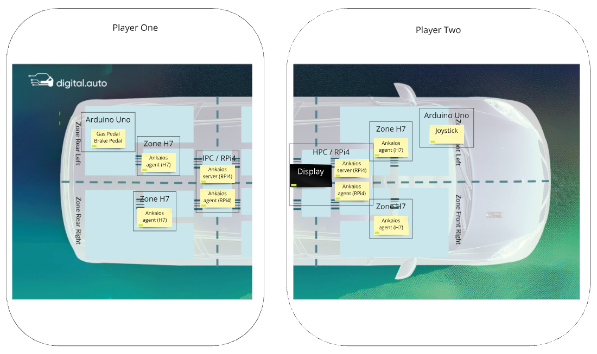

# Eclipse SDV Hackathon 2024 Chapter Two

One-Pager ([PowerPoint](./assets/Eclipse_SDV_Hackathon_Two_2024_PlayByWire_Poster.pptx), [PDF](./assets/Eclipse_SDV_Hackathon_Two_2024_PlayByWire_Poster.pdf))

## Welcome to the 'Play by Wire' hack challenge! 

The idea of the 'Play by Wire' use case is that the driver or/and a passenger can play with each other while not driving and using Vehicle internal inputs to play!

This hack challenge focuses on encouraging creativity, ideate ideas in the form of rapid prototyping in the playground of __digital.auto__ and transfer them easily to a working vehicle. 
You can use the Eclipse projects [__Velocitas__](https://eclipse.dev/velocitas/), [__Kuksa__](https://www.eclipse.org/kuksa/), [__Ankaios__](https://eclipse-ankaios.github.io/ankaios), [__digital.auto__](https://playground.digital.auto/), [__Eclipse ThreadX__](https://github.com/eclipse-threadx/rtos-docs/blob/main/rtos-docs/threadx/index.md)

Inputs as example:

[__Joystick input__](https://docs.sunfounder.com/projects/elite-explorer-kit/en/latest/basic_projects/20_basic_joystick.html#overview).

In this hack challenge, you can
- ideate your use case in easy way by using the provided playground,
- explore the Eclipse SDV ecosystem of open source projects, such as programming models, vehicle abstraction layer and protocol implementations.

Your hack team should have the following skills:
- Some development skills in Python
- Rudimentary Linux, git, shell skills are always a plus. 
- Some knowledge in network protocols such as MQTT is good.
- A bit of Docker, containerd, k8s experience would be good as well, for building your app as a container and deploy it to a container runtime on the device.
- Arduino basic skills

We would recomment the following steps for the hack challenge:

Step 1: Investigate your Inputs e.g.
- Arduino for "real" inputs [__Joystick input__](https://docs.sunfounder.com/projects/elite-explorer-kit/en/latest/basic_projects/20_basic_joystick.html#overview)
- Keyboard inputs for Simulated Inputs 
- XBox or PC with Telemetry datastream over UDP [forza-udp-databroker-proxy](https://github.com/Eclipse-SDV-Hackathon-Chapter-Two/forza-udp-databroker-proxy)

Step 2: Identify your Game to play (e.g. Pong, FlappyBird, SuperTux Kart)
- [Pong example with python and Kuksa databroker client](https://github.com/Eclipse-SDV-Hackathon-Chapter-Two/kuksa-val-pong)
- [SuperTux Kart](https://github.com/supertuxkart/stk-code)
- [Digital.auto FlappyBird variant with VSS subscription](https://bewebstudio.digitalauto.tech/data/projects/Ld8cAK35pFCw/FlappyBird-Widget-main/index.html)
- or any other game you can create or modifiy

Step 3: Choose your deployment architecture (Design E/E Architecture of your "Test Vehicle")
- Minimum amount are 2 Zones for Input and HPC/Display for output and processing
- Optional: Extra points will be granted for transmitting the data over CAN Bus (Embedded Bus) and [Open1722 protocol](https://github.com/COVESA/Open1722) to the databroker
- choose any draw tool (draw.IO or PPT or PlantUML or ...)
Example: 
||

Step 4: Create a API wishlist with digital.auto for getting your interfaces defined
A tutorial form previous Hackthons can be found here: [HackChallange Passenger Welcome](https://github.com/Eclipse-SDV-Hackathon-BCX/hackchallenge-passenger-welcome/blob/main/docs/step-1-prototyping.md)
- Create a protoype with digital.auto: [Tutorial](https://eclipse.dev/velocitas/docs/tutorials/prototyping/digital_auto/) and [short video](https://drive.google.com/file/d/1qYfakx6E592PWBtPzAc_m_LrmBsvaI9K/view)
- Create your own JSON with the COVESA [Vehicle Signal Specification (VSS)](https://covesa.github.io/vehicle_signal_specification/introduction/)

Step 5: Choose the proper tool for deployment on the different domains (Hint: Ankaios will bring you extra complexity but more points ;) )
[See the tutorial here](https://github.com/Eclipse-SDV-Hackathon-Accenture/maestro-challenge/blob/main/eclipse-ankaios/README.md)

Step 6: Split up the team to get specialized in your domains and start hacking :)

You can test your prototype for example on the following hardware setups:
Arduino Uno as Input with Joystick
Raspberry Pi4 with Ubuntu and attached display
ThreadX Eval Board with input of your choise
Arduino H7 with Open1722 Protocol on it to pass through your CAN messages to Ethernet
Your own Linux PC (recomended) 

And always remember: The Hack Coached are there to help if you get stuck.

Happy hacking!
